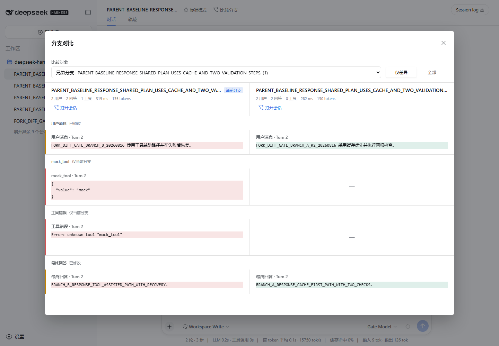
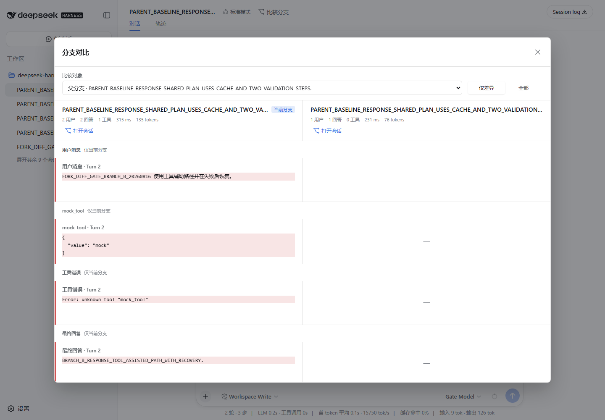
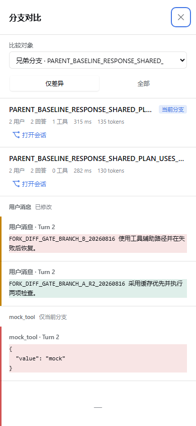

# dsh-fork-diff

在 DeepSeek Harness 中并排比较相关会话分支。它把当前会话与父分支、子分支或兄弟分支的公开历史对齐，突出回答、工具调用和工具结果的差异，全程只读。

## 为什么需要它

同一轮对话 fork 后，常见问题不是“有哪些分支”，而是“两个分支的公开历史具体有哪些不同”。逐个打开会话并来回滚动很难比较长回答、工具轨迹和 token 开销。`dsh-fork-diff` 将这些信息放在一个可筛选的双栏视图中。

## 功能

- 自动发现当前会话的父、子和兄弟分支，不混入无关会话。
- 对齐用户消息、assistant 最终回答、工具调用和工具结果。
- 区分不变、已修改、仅左侧和仅右侧内容，并提供行级文本高亮。
- 汇总用户消息、回答、工具调用、耗时和可见 token usage。
- 支持比较对象切换、只看变化/显示全部、打开对应会话。
- 支持桌面双栏、移动端单栏、Escape 关闭、焦点陷阱和焦点恢复。
- 完整历史反向分页，包含取消、重复序号、无进展、非连续页和页数上限保护。
- 大历史和长文本会显式进入快速对齐模式，不把近似结果伪装成精确结果。

## 安装

需要 DeepSeek Harness `0.1.0-rc.5` 或兼容版本，以及 Node.js `^22.19.0 || >=24.0.0`。

`v0.1.0` Release 发布后，可用下面的一行命令安装预构建 tarball 到 `web` profile：

```powershell
dsh plugin --profile web add https://github.com/chouyong/dsh-fork-diff/releases/download/v0.1.0/dsh-fork-diff-0.1.0.tgz
```

启动或重启对应 profile：

```powershell
dsh --profile web
```

Release 发布前或需要复核构件时，可先使用本仓库本地已验证的 tarball：

```powershell
dsh plugin --profile web add .\dsh-fork-diff-0.1.0.tgz
```

DSH `0.1.0-rc.5` 当前从 Git source 安装时会在 prepare 阶段解析到尚未发布的 DSH peer 包，因此不把 Git source 路径描述成可用安装方式。远端 Release 只有在上传后下载并核对与本地验证构件相同的 SHA-256，才视为可用安装源。

卸载：

```powershell
dsh plugin --profile web remove dsh-fork-diff
```

## 使用

1. 打开一个存在父、子或兄弟分支的 DSH 会话。
2. 点击会话标题栏中的“比较分支”。
3. 从“比较对象”选择相关分支。
4. 在“仅差异”和“全部”之间切换，或从分支摘要中打开对应会话。

没有相关分支时，插件不会显示一个无效的比较入口。

## 截图

真实 DSH `0.1.0-rc.5`，Microsoft Edge，2026-08-16：

### 兄弟分支差异



### 父分支选择



### 移动端单栏



## 隐私与边界

插件只读取 DSH 浏览器中已公开的会话列表和 `sessions.history` API：

- 不创建 fork，不写 session event，不修改文件。
- 不恢复后台 Agent，不注入 prompt，不上传会话正文。
- 不读取 Cookie、凭据、隐藏数据库或未公开运行态。
- 不判断哪个分支“更好”，不执行 merge 或 cherry-pick。
- 客户端摘要没有公开持久化 `seedLength`，因此 v1 不宣称精确 fork 点或事件级共同祖先。

## 开发

```powershell
npm install --ignore-scripts --legacy-peer-deps
npm run verify
```

`npm run verify` 依次执行类型检查、生产构建、完整测试和 browser bundle contract。浏览器构件使用 DSH `window.__ModuleLoader__`，并从宿主加载 React、Cordis 和 DSH UI 模块，避免打包第二份 React。

贡献代码前请阅读 [贡献指南](./CONTRIBUTING.md)。
模块边界、数据流和失败关闭策略见 [架构文档](./docs/architecture.md)。

## 兼容性

| 组件 | 已验证版本 |
| --- | --- |
| DeepSeek Harness | `0.1.0-rc.5` |
| Node.js | `v25.0.0` |
| npm | `11.6.2` |
| pnpm（DSH profile） | `11.7.0` |

## License

[MIT](./LICENSE)
